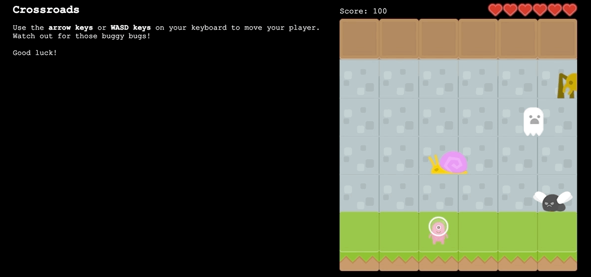

# Crossroads



[insert live link]

Crossroads is an arcade-style game built with a game loop engine and visual assets to re-create the classic game, Frogger. The game begins with the player in the grassy bottom portion of the screen. Arrow keys or WASD keys are used to navigate the player across the landscape. Enemy bugs travel across the screen at different velocities as the player tries to make it to the river.

If the player collides with an enemy bug, the player loses a heart and is reset back to the starting point on the grassy bottom portion of the screen until the player runs out of hearts.


Crossroads utilizes the following:
* Javascript ES6
* HTML5 Canvas
* jQuery

# Gameplay and Features

Crossroads contains 3 enemy bugs. In order to continue gameplay, the player must successfully reach the river.

Current features of the game include:
-[x] Laterally-moving enemies to avoid
-[x] Enemies travel at random velocities and increase in speed with each next level
-[x] Statistics (score and hearts) are tracked and updated live on-screen
-[x] Includes WASD movement (sorry, no strafeing)
-[x] On-page instructures are viewable to guide the player

### Keyboard-Based Controls

The player controls all movement of the paddle via arrow keys or WASD. Upon triggering a keyup event, the event listener will return the direction of the arrow key.

After adding or subtracting any offset pixels, if the resulting value is positive and within the board's limitations, the player's position will be updated.

```javascript
handleInput = key => {
  switch (key) {
    case 'left':
      return this.x -= game.tileWidth;
    case 'right':
      return this.x += game.tileWidth;
    case 'up':
      this.y -= game.tileHeight;
      return this.checkWin();
    case 'down':
      return this.y += game.tileHeight;
  }
}
```

### Collision Detection

  During gameplay, two entities are able to collide with each other--the player and the enemy bug.

  Crossroads uses a common algorithm for game development, 2D collision detection. In this game, an axis aligned (no rotation) rectangular shape covers both entities, the player and the enemy bugs, and are considered "hitboxes." If there is any gap between the hitboxes, there is no collision. 

  ```javascript
  checkCollisions = () => {
    allEnemies.forEach(enemy => {
      let enemyBoundingBox =
        enemy.x < this.x + game.playerWidth
        && enemy.x + (game.enemyWidth - 30) > this.x
        && enemy.y < this.y + game.playerHeight
        && enemy.y + game.enemyHeight > this.y;

        enemyBoundingBox && this.gameOver();
    });
  }
  ```

### Player status

<details>
  <summary>Score</summary>
  <p>Players earn points for each successful crossing and each enemy's velocity increases via an accelerator constant after 250 points have been delegated.</p>
</details>

<details>
  <summary>Hearts</summary>
  <p>At the start of each game, the player has six hearts. For each collision with an enemy, the player loses a heart and is reset back to the starting point. When the player has no more hearts, they lose.</p>
</details>

# Future Release
- [ ] Pause and Resume
